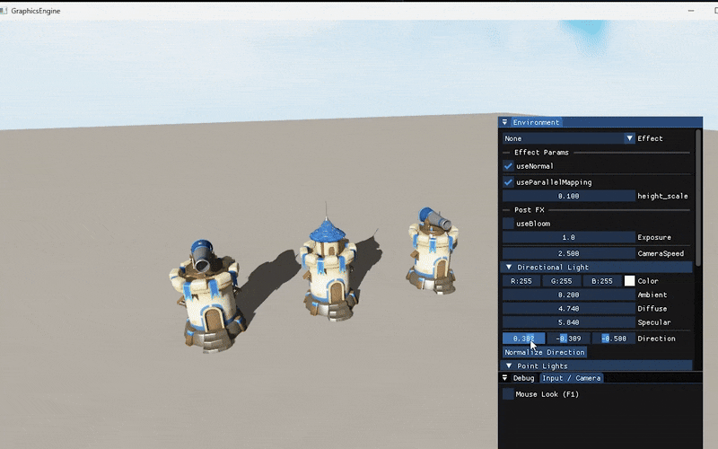
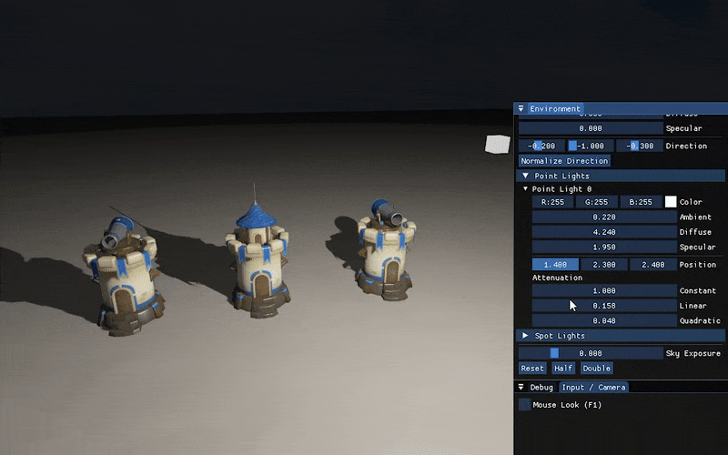
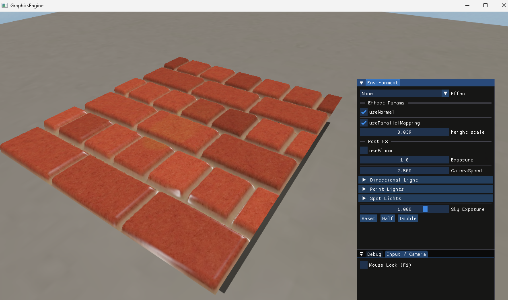
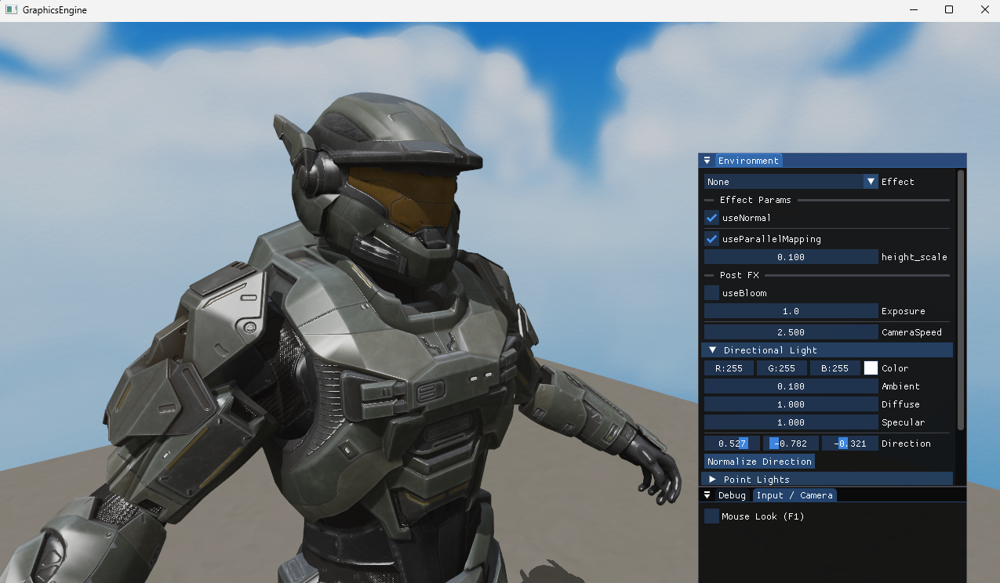
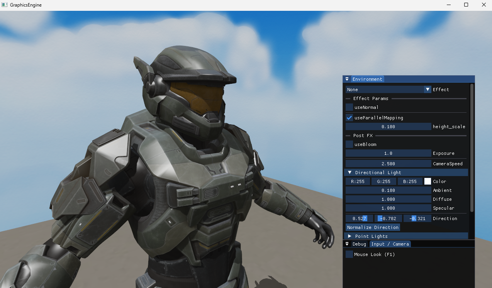

# Kaizen Engine
---

## 🎬 Showcase

### 💡 Lighting System

#### Directional Light

#### Point Light

---

### 🧱 Parallax Occlusion Mapping (POM)

| With Parallax Mapping | Without Parallax Mapping |
|------------------------|--------------------------|
|  |  |

---

### ⚙️ Normal Mapping

| With Normal Mapping | Without Normal Mapping |
|----------------------|------------------------|
|  |  |

---

## Features

### Core Systems
- Scene and Camera management
- Keyboard and Mouse input handling
- Free-flight 3D camera (WASD + QE movement)
- Mouse-look toggle (F1) for easy navigation

---

### Rendering & Graphics
- Custom **render pipeline** using **Framebuffers**
- **Multiple Render Targets (MRT)** for post-processing
- **Anti-Aliasing (MSAA)** for smooth visuals
- **HDR (High Dynamic Range)** rendering with toon tone-mapping
- **Skybox abstraction** for environment rendering

---

### Lighting System
- Flexible **Light Manager** with ImGui controls
- Supports:
  - Directional Lights
  - Point Lights
  - Spot Lights
- Emission material support

---

### Real-Time Shadows
- Real-time **shadow mapping** for all light types:
  - Directional
  - Point
  - Spot
- **Geometry shader-based point light shadows**
- Fixed **Peter Panning** and improved depth stability

---

### Shader & Material System
- **Shader abstraction layer** for dynamic shader loading
- **Uniform Buffer Object (UBO)** for shared camera matrices
- **Normal Mapping** for detailed lighting
- **Parallax Occlusion Mapping (POM)** for height illusion
- Adjustable:
  - Shininess
  - Height scale
  - Normal/parallax toggles

---

### Post-Processing Effects
- Integrated **Post FX pipeline** with ImGui control
- Supported effects:
  - **Bloom**
  - **Box Blur / Gaussian Blur**
  - **Sobel Edge Detection**
---

### Framebuffer System
- Full **FrameBuffer abstraction** supporting:
  - Color / Depth / Stencil attachments
  - MRT and MSAA configurations
- Used for shadow maps and post-FX passes

---

## Tech
- **Language:** C++17  
- **Graphics API:** OpenGL 4.6  
- **Libraries:** GLM, GLFW, Glad, ImGui, STB, Assimp  